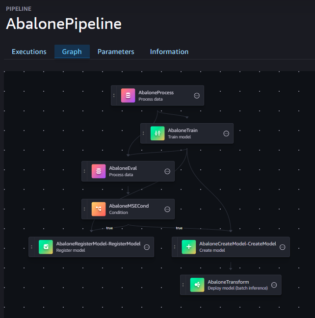

# SageMaker-ML-End2End
Leveraging the power of AWS SageMaker SDK to streamline the entire machine learning lifecycle.

## How to Productionalize your ML Model

An example of how to take your model that you have created in Jupyter Notebook or Google Colab into a Production environment.

You can use SageMaker's drag-and-drop Pipeline Designer to visually create a pipeline. However, this code shows how you can generate your pipeline definition using the SageMaker Python SDK.

This code will create a Learning Pipeline, a modular, reproducible, scalable sequence of operations from within AWS SageMaker to transform raw data into actionable insights.

This will show how to deploy your ML project into AWS SageMaker, using its pre-built modules to execute the pipeline.

This code assumes you know how to access your AWS environment from the Console, and have basic AWS SageMaker knowledge on how to start a SageMaker Domain and a Notebook instance.

You can preview the Pipeline in _SageMaker Studio_ _Pipelines_

_This is the DAG Image of the Pipeline that is created by the following Notebook SageMaker SDK_

## SageMaker SDK Example

The provided Python notebook demonstrates how to use the SageMaker SDK to create an ML pipeline. Here's an overview of the key components:

1. **Data Preparation**: The code downloads and prepares the Abalone dataset for training.

2. **Pipeline Parameters**: Defines parameters for the pipeline, such as instance count and model approval status.

3. **Processing Step**: Uses SKLearnProcessor for data preprocessing.

4. **Training Step**: Configures and runs an XGBoost training job.

5. **Evaluation Step**: Processes the trained model to evaluate its performance.

6. **Conditional Step**: Implements a condition to check if the model meets performance criteria.

7. **Model Registration**: Registers the model if it passes the performance threshold.

8. **Batch Transform**: Performs batch transformation on a test dataset.

The pipeline combines these steps into a cohesive workflow, demonstrating how to:

- Create and configure various SageMaker step types
- Handle data processing and model training
- Implement conditional logic in the pipeline
- Register and deploy models based on performance criteria

This example provides a comprehensive template for building end-to-end ML pipelines using the SageMaker SDK, showcasing best practices for productionizing ML models in AWS SageMaker.
 
